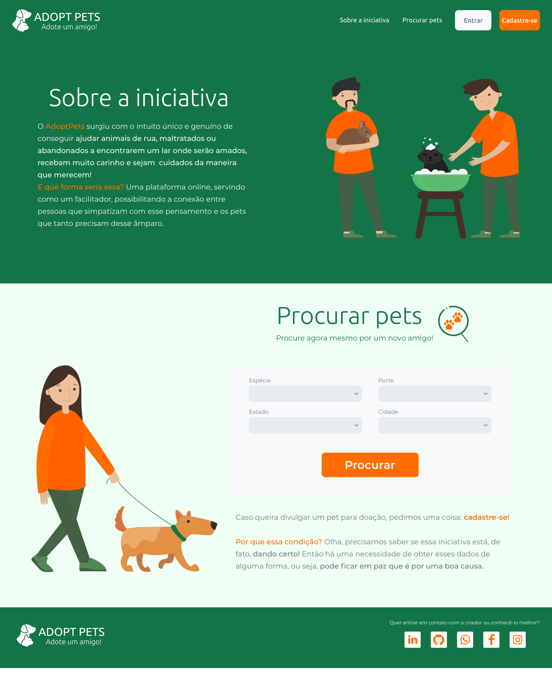
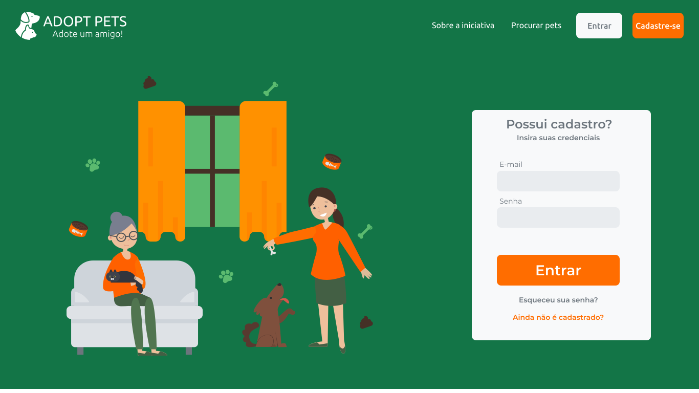

<h1 align="center">
  
</h1>

Esse projeto consiste em um site com o intuito de auxiliar pessoas a adotar ou colocar para doação animais de estimação que necessitam de um primeiro/novo lar! 

---

 <a href="#sobre-a-iniciativa">Sobre</a> &nbsp|&nbsp
 <a href="#layouts">Layouts</a> &nbsp|&nbsp 
 <a href="#tecnologias">Tecnologias</a> &nbsp|&nbsp
 <a href="#como-rodar-a-aplicação">Como rodar a aplicação</a> &nbsp|&nbsp
 <a href="#autor">Autor</a>

<h4 align="center"> 
	🚧 &nbsp&nbsp Projeto em construção! Iniciando pelo Front-End &nbsp&nbsp 🚧
</h4>

<h2>Sobre a Iniciativa</h2>

O <b>AdoptPets</b> surgiu com o intuito único e genuíno de conseguir ajudar animais de rua, maltratados ou abandonados a encontrarem um lar onde serão amados, recebam muito carinho e sejam cuidados da maneira que merecem!

<b>E que forma seria essa?</b> Uma plataforma online, servindo como um facilitador, possibilitando a conexão entre pessoas que simpatizam com esse pensamento e os pets que tanto precisam desse âmparo.

 

<h2>Layouts</h2>

<h3>Página Inicial</h3>

<h3>Página de Login</h3>

<h2>Tecnologias</h2>

##### Para construção do Front-End estão sendo usadas as seguintes tecnologias:

- JavaScript
- ReactJS
- CSS3

<h2>Como rodar a aplicação</h2>

<h3>1. Pré-requisitos</h3> 

Antes de começar, você vai precisar ter instalado em sua máquina as seguintes ferramentas: [Git]([https://git-scm.com](https://git-scm.com/)), [Node.js](https://nodejs.org/en/) e [Yarn](https://yarnpkg.com/).  Além disso, é bom ter um editor para trabalhar com o código, como por exemplo: [VSCode](https://code.visualstudio.com/)

<h3>2. Passo à passo</h3>

<h5>Clone este repositório</h5>
$ git clone https://github.com/erickd-moraes/adopt-pets.git

<h5>Acesse a pasta do projeto no terminal</h5>
$ cd adopt-pets

<h5>Instale as dependências</h5>
$ yarn install

<h5>Execute a aplicação em modo de desenvolvimento</h5>
$ yarn start

 
 

A aplicação inciará e provavelmente irá automaticamente abrir em seu navegador padrão. Caso isso não aconteça, acesse: <b>http://localhost:3000</b>

<h2>Autor</h2>

	

Sendo construído com ❤️ por Érick Moraes. Caso queira, entre em contato!

 

